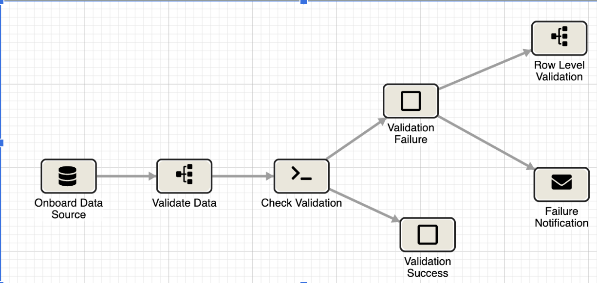

# InfoworksDataValidator

Infoworks DataValidator is a tool that helps in creating pipelines to validate 2 tables by computing the column checksum, row checksum and create a final data validation summary report.
<br>
This solution follows a layered approach to validation and creates pipelines using Infoworks Rest APIs.
<br>

Infoworks Data Validator, provides seamless integration, automated, scalable and repeatable solution for data validation across different environments. 
<br>

The adapter uses the Infoworks platform to connect to a large number of data sources and automatically validates data integrity at every step of the data migration process.
<br>

Once the Data Validation pipelines are created, these processes can then be orchestrated in Infoworks to deliver the automated solution with notification.


<br>

### Steps to install and use infoworks validator tool:
1) Create a virtual environment
```shell
python3 -m venv env 
source ./env/bin/activate
```
2) ``` pip install -e . ```

3) Start using the tool

**Example:** 
<br>
iwx-datavalidation-tool --source_table_name healthcare_dataproc.healthcare_member_source --target_table_name healthcare.helathcare_member_target --source_name Big_query_Sync --target_name Big_query_Sync --compute_type bigquery --group_by_cols_for_checksum "extract(year from REGISTRATION_DATE)" --join_cols_row_checksum member_id --pipeline_target_schema_name accenture_data_validation --pipeline_suffix healthcare_member

### **Available parameters for the tool** 


**compute_type** -> Provide the compute name on which the validations are run. _bigquery_/_spark_/_snowflake_ <br>
**validation_type** -> Pass the name of validation. Choose one among '_column_hash_', '_row_hash_', '_validation_summary_', '_all_'. Pass '_all_' to create all 3 pipelines per table <br>
**pipeline_suffix** -> Suffix with which the pipelines have to be created. Usually this can be table name<br>
**source_table_name** -> Fully qualified source table name. _Example_: `default.sample_customer_table_src`
**target_table_name** -> Fully qualified target table name. _Example_: `default.sample_customer_table_tgt`
**source_name** -> Pass the name of the source in Infoworks in which source tables are present <br>
**target_name** -> Pass the name of the source in Infoworks in which target tables are present <br>
**group_by_cols_for_checksum** -> Pass the comma separated list of columns on which group by is performed <br>
**agg_cols_for_checksum** -> Comma separated list of columns on which aggregation is performed. By default all columns part of source table <br>
**distinct_count_cols** -> Comma separated list of columns on which distinct count is performed during row level validation <br>
**join_cols_row_checksum** -> Pass the comma separated list of columns on which the source and target tables are joined in row checksum pipelines <br>
**ignore_columns_from_validation** -> Pass the comma seperated list of columns to ignore during validation <br>
**skip_column_name_and_datatype_validation** -> _true/false_. If set to _true_, column name and datatype validation is skipped and pipelines will be created no matter what <br>
**regex_exp** -> Regular expression to remove ascii characters from data. Default: '[\\W&&[^\\s+]]' <br>
**remove_ascii_from_cols** -> List of columns from which ascii characters are to be removed. _Default_: All string columns if regex_replace is enabled <br>
**regex_replace** -> True/False. Variable to enable/disable removing of ascii characters from string columns <br>
**natural_keys** -> Comma separated list of columns to be configured as natural keys <br>
**pipeline_target_schema_name** -> Pass the target schema name in which pipeline targets are to be created <br>
**data_profiling** -> _True/False_. If set to _True_, data profiling columns will be enabled in  the column checksum pipeline <br>
**domain_name** -> Pass the domain name in which pipeline has to be created <br>
**environment_name** -> Pass the environment name in which pipeline has to be created <br>
**storage_name** -> Pass the storage name the pipeline has to use <br>
**compute_name** -> Pass the compute name the pipeline has to use <br>
